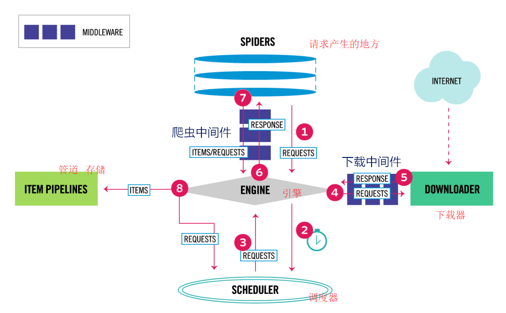

# Scrapy框架基础用法




### 重写请求方法

* 作用
  * 初始url需要请求头信息
  * 初始url需要发起post请求

* 重写  start_requests

  

### 下载中间件

* 方法含义介绍

  ```python
  class DownloaderMiddleware(object):
      # Not all methods need to be defined. If a method is not defined,
      # scrapy acts as if the downloader middleware does not modify the
      # passed objects.

      @classmethod
      def from_crawler(cls, crawler):
          # This method is used by Scrapy to create your spiders.
          s = cls()
          crawler.signals.connect(s.spider_opened, signal=signals.spider_opened)
          return s

      def process_request(self, request, spider):
          # Called for each request that goes through the downloader
          #处理请求  参数  request  spider对象
          # middleware.

          # Must either:  以下必选其一
          # - return None: continue processing this request #返回None   request 被继续交个下一个中间件处理
          # - or return a Response object #返回response对象   不会交给下一个precess_request  而是交给下载器
          # - or return a Request object #返回一个request对象   直接交给引擎处理
          # - or raise IgnoreRequest: process_exception() methods of   #抛出异常  process_exception处理
          #   installed downloader middleware will be called
          return None

      def process_response(self, request, response, spider):
          # Called with the response returned from the downloader.
          #处理响应  request, response, spider

          # Must either;
          # - return a Response object   #继续交给下一中间件处理
          # - return a Request object     #返回一个request对象   直接交给引擎处理
          # - or raise IgnoreRequest     #抛出异常    process_exception处理
          return response

      def process_exception(self, request, exception, spider):
          # Called when a download handler or a process_request()
          # (from other downloader middleware) raises an exception.
          #处理异常

          # Must either:
          # - return None: continue processing this exception  #继续调用其他中间件的process_exception
          # - return a Response object: stops process_exception() chain  #返回response  停止调用其他中间件的process_exception
          # - return a Request object: stops process_exception() chain   #返回request  直接交给引擎处理
          pass

      def spider_opened(self, spider):
          spider.logger.info('Spider opened: %s' % spider.name)
  ```

  ​


* UA池

  * middlewares文件设置用户代理

    ```python
    from .settings import user_agent_list
    class User_AgentDownloaderMiddleware(object):

        def process_request(self, request, spider):
            request.headers["User_Agent"]=random.choice(user_agent_list) #随机选择一个UA
            # Called for each request that goes through the downloader
            #处理请求  参数  request  spider对象
            # middleware.

            # Must either:  以下必选其一
            # - return None: continue processing this request  #返回None   request 被继续交个下一个中间件处理
            # - or return a Response object    #返回response对象   不会交给下一个precess_request  而是交给下载器
            # - or return a Request object     #返回一个request对象   直接交给引擎处理
            # - or raise IgnoreRequest: process_exception() methods of   #抛出异常  process_exception处理
            #   installed downloader middleware will be called
            return None
    ```

  * 用户代理池

    ```python
        user_agent_list = [
        "Mozilla/5.0 (Windows NT 6.1; WOW64) AppleWebKit/537.1 ",
        "(KHTML, like Gecko) Chrome/22.0.1207.1 Safari/537.1",
        "Mozilla/5.0 (X11; CrOS i686 2268.111.0) AppleWebKit/536.11 "
        "(KHTML, like Gecko) Chrome/20.0.1132.57 Safari/536.11",
        "Mozilla/5.0 (Windows NT 6.1; WOW64) AppleWebKit/536.6 "
        "(KHTML, like Gecko) Chrome/20.0.1092.0 Safari/536.6",
        "Mozilla/5.0 (Windows NT 6.2) AppleWebKit/536.6 "
        "(KHTML, like Gecko) Chrome/20.0.1090.0 Safari/536.6",
        "Mozilla/5.0 (Windows NT 6.2; WOW64) AppleWebKit/537.1 "
        "(KHTML, like Gecko) Chrome/19.77.34.5 Safari/537.1",
        "Mozilla/5.0 (X11; Linux x86_64) AppleWebKit/536.5 "
        "(KHTML, like Gecko) Chrome/19.0.1084.9 Safari/536.5",
        "Mozilla/5.0 (Windows NT 6.0) AppleWebKit/536.5 "
        "(KHTML, like Gecko) Chrome/19.0.1084.36 Safari/536.5",
        "Mozilla/5.0 (Windows NT 6.1; WOW64) AppleWebKit/536.3 "
        "(KHTML, like Gecko) Chrome/19.0.1063.0 Safari/536.3",
        "Mozilla/5.0 (Windows NT 5.1) AppleWebKit/536.3 "
        "(KHTML, like Gecko) Chrome/19.0.1063.0 Safari/536.3",
        "Mozilla/5.0 (Macintosh; Intel Mac OS X 10_8_0) AppleWebKit/536.3 "
        "(KHTML, like Gecko) Chrome/19.0.1063.0 Safari/536.3",
        "Mozilla/5.0 (Windows NT 6.2) AppleWebKit/536.3 "
        "(KHTML, like Gecko) Chrome/19.0.1062.0 Safari/536.3",
        "Mozilla/5.0 (Windows NT 6.1; WOW64) AppleWebKit/536.3 "
        "(KHTML, like Gecko) Chrome/19.0.1062.0 Safari/536.3",
        "Mozilla/5.0 (Windows NT 6.2) AppleWebKit/536.3 "
        "(KHTML, like Gecko) Chrome/19.0.1061.1 Safari/536.3",
        "Mozilla/5.0 (Windows NT 6.1; WOW64) AppleWebKit/536.3 "
        "(KHTML, like Gecko) Chrome/19.0.1061.1 Safari/536.3",
        "Mozilla/5.0 (Windows NT 6.1) AppleWebKit/536.3 "
        "(KHTML, like Gecko) Chrome/19.0.1061.1 Safari/536.3",
        "Mozilla/5.0 (Windows NT 6.2) AppleWebKit/536.3 "
        "(KHTML, like Gecko) Chrome/19.0.1061.0 Safari/536.3",
        "Mozilla/5.0 (X11; Linux x86_64) AppleWebKit/535.24 "
        "(KHTML, like Gecko) Chrome/19.0.1055.1 Safari/535.24",
        "Mozilla/5.0 (Windows NT 6.2; WOW64) AppleWebKit/535.24 "
        "(KHTML, like Gecko) Chrome/19.0.1055.1 Safari/535.24"
    ]
    ```

* IP池

  * middlewares文件设置用户代理

    ```python
    from .settings import IPPOOL
    class MyproxyDownloaderMiddleware(object):
        #目的  设置多个代理
        #通过meta  设置代理
        def process_request(self, request, spider):
            proxyip=random.choice(IPPOOL)
            request.meta["proxy"]="http://"+proxyip["ipaddr"]#http://61.129.70.131:8080
            
            # Must either:  以下必选其一
            # - return None: continue processing this request  #返回None   request 被继续交个下一个中间件处理
            # - or return a Response object    #返回response对象   不会交给下一个precess_request  而是交给下载器
            # - or return a Request object     #返回一个request对象   直接交给引擎处理
            # - or raise IgnoreRequest: process_exception() methods of   #抛出异常  process_exception处理
            #   installed downloader middleware will be called
            return None
    ```

  * settings中ip 代理池

    ```python
    #IP代理池
    IPPOOL=[
        {"ipaddr":"61.129.70.131:8080"},
        {"ipaddr":"61.152.81.193:9100"},
        {"ipaddr":"120.204.85.29:3128"},
        {"ipaddr":"219.228.126.86:8123"},
        {"ipaddr":"61.152.81.193:9100"},
        {"ipaddr":"218.82.33.225:53853"},
        {"ipaddr":"223.167.190.17:42789"}
    ]
    ```

    * ip代理网站    豌豆   芝麻  阿布云  青果

  ​


### Request 对象

Scrapy.http.Request类是scrapy框架中request的基类。它的参数如下：

- **url**（字符串） - 此请求的URL
- **callback**（callable）- 回调函数
- **method**（string） - 此请求的HTTP方法。默认为'GET'。
- **meta**（dict） - Request.meta属性的初始值。
- **body**（str 或unicode） - 请求体。如果没有传参，默认为空字符串。
- **headers**（dict） - 此请求的请求头。
- **cookies** - 请求cookie。
- **priority**（int） - 此请求的优先级（默认为0）,数字越大优先级越高。
- **dont_filter**（boolean） -默认 False,  过滤请求。True， 表示调度程序不应过滤此请求。
- **errback**（callable） - 在处理请求时引发任何异常时将调用的函数

### Response对象

* **url**（字符串） - 此响应的URL

* **status**（整数） - 响应的HTTP状态。默认为200。

* **headers**（dict） - 此响应的响应头。

* **body**（字节） - 响应主体。

* **text**（字符串） - 响应主体。

* **request**（Requestobject） - Response.request属性的初始值。这表示Request生成此响应的内容。
  * **url** 包含此请求的URL的字符串。该属性是只读的。更改请求使用的URL replace()。
  * **method**  表示请求中的HTTP方法的字符串。
  * **headers** 类似字典的对象，包含请求头。
  * **body** 包含请求正文的str。该属性是只读的。更改请求使用的URL replace()。
  * **meta** 包含此请求的任意元数据的字典。
  * **copy()** 返回一个新的请求，该请求是此请求的副本。
  * **replace**（[ URL，method，headers，body，cookies，meta，encoding，dont_filter，callback，errback] ） 

  


## Scrapy.settings

### 基本设置

1. 项目名称，也作为日志记录的日志名

   BOT_NAME = 'info'   

2. 爬虫应用路径

   SPIDER_MODULES = ['info.spiders']

   NEWSPIDER_MODULE = 'info.spiders'

3. 客户端User-Agent请求头

   1. USER_AGENT = ' '

4. Scrapy发送HTTP请求默认使用的请求头

   DEFAULT_REQUEST_HEADERS = {

   'Accept': 'text/html,application/xhtml+xml,application/xml;q=0.9,*/*;q=0.8',

   'Accept-Language': 'en',

   }

5. 是否遵循爬虫协议

   ROBOTSTXT_OBEY = False

6. 是否支持cookie，cookiejar进行操作cookie，默认开启

   COOKIES_ENABLED = False

7. 日志

   LOG_FILE="film.log"

   LOG_LEVEL="INFO"     等级 DEBUG < INFO < WARNING < ERROR < CRITICAL

### 2.并发与延迟

1. 下载器总共最大处理的并发请求数,默认值16

   CONCURRENT_REQUESTS = 10

2. 每个域名能够被执行的最大并发请求数目，默认值8

   CONCURRENT_REQUESTS_PER_DOMAIN = 16    www.baidu.com  

3. 能够被单个IP处理的并发请求数，默认值0，代表无限制，需要注意两点

   CONCURRENT_REQUESTS_PER_IP = 16   

   * 如果不为零，那CONCURRENT_REQUESTS_PER_DOMAIN将被忽略，即并发数的限制是按照每个IP来计算，而不是每个域名
   * 该设置也影响DOWNLOAD_DELAY，如果该值不为零，那么DOWNLOAD_DELAY下载延迟是限制每个IP而不是每个域 名

4. 如果没有开启智能限速，这个值就代表一个规定死的值，代表对同一网址延迟请求的秒数

   DOWNLOAD_DELAY = 3

### 3.请求重试（retry）与超时

​	RETRY_ENABLED: 是否开启retry； 默认开启

​	RETRY_TIMES: 重试次数；    默认3次

​	RETRY_HTTP_CODES: 需要重试的http code；默认是500,502,503,504,408

​	DOWNLOAD_TIMEOUT：超时时间 ;默认180s 

### 4.中间件、Pipelines、扩展

1. Enable or disable spider middlewares

   SPIDER_MIDDLEWARES = {'baidu.middlewares.AmazonSpiderMiddleware': 543,}

2. Enable or disable downloader middlewares

   **DOWNLOADER_MIDDLEWARES** = { # 'info.middlewares.DownMiddleware1': 543, }

3. Enable or disable extensions

   EXTENSIONS = {#'scrapy.extensions.telnet.TelnetConsole': None,#}

4. **Configure item pipelines**

   **ITEM_PIPELINES** = {'info.pipelines.InfoPipeline': 200, }


​